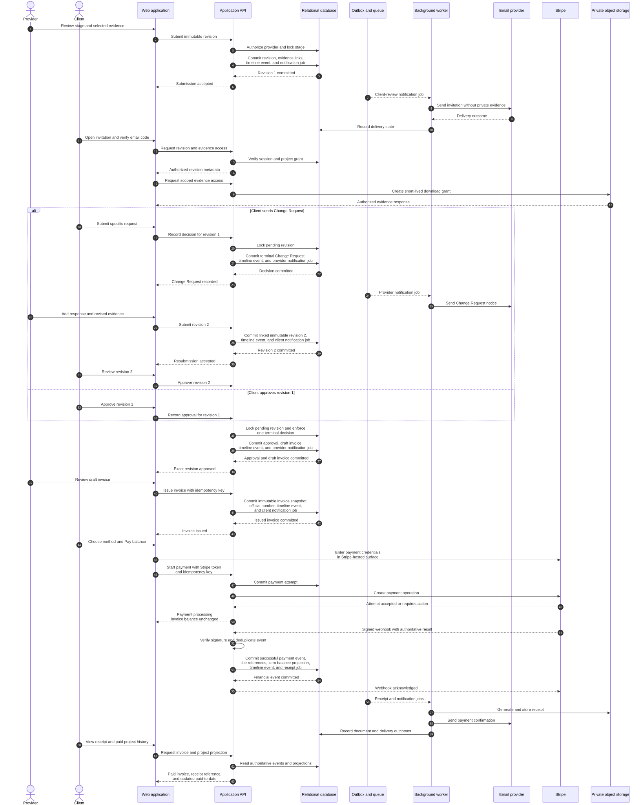

# Initial System Architecture

**Status:** Proposed for MVP

**Last updated:** 2026-09-15

## Objective

Define a secure, auditable, and practical starting architecture for StagePaid's
MVP. The design supports staged agreements, immutable review revisions,
passwordless client access, private evidence, invoice issuance, payment
processing, notifications, and financial history without introducing
microservices before the product requires them.

This document defines logical boundaries and data flow. Individual technology
and provider choices belong in architecture decision records under issue #7.

## Architectural approach

StagePaid begins as a **modular monolith** with one deployable application and
one primary relational database. Modules enforce business boundaries inside the
codebase, while durable jobs isolate communication with external systems.

This approach provides:

- one transactional boundary for closely related project, review, invoice, and
  ledger changes;
- fewer distributed-failure modes during MVP development;
- straightforward local development, testing, deployment, and observability;
- explicit module seams that can become services later if scale or ownership
  requires it; and
- a stable application API that future iOS and Android clients can reuse.

The clickable prototype is a research artifact. Its Vinext implementation and
in-memory state do not select the production application stack.

## System context

StagePaid serves two primary actors:

- **Provider:** defines projects and stages, submits work, responds to Change
  Requests, issues invoices, and reviews financial records.
- **Client:** enters through a scoped invitation, reviews submitted evidence,
  sends a Change Request or approval, views invoices, and submits payment.

The application integrates with:

- an email delivery provider for invitations, verification codes, and business
  notifications;
- Stripe Connect for provider onboarding, payment collection, refunds,
  disputes, fees, settlement, and authoritative payment events; and
- managed object storage for private evidence and generated documents.

See [`diagrams/system-containers.mmd`](diagrams/system-containers.mmd) for the
container-level view.

The primary stage-to-payment path is shown in
[`diagrams/stage-to-payment-sequence.mmd`](diagrams/stage-to-payment-sequence.mmd).
It includes the Change Request branch and distinguishes committed business
transactions from eventually delivered notifications, documents, and processor
outcomes.

## Runtime containers

### Web application

The responsive web application provides provider and client experiences. It:

- renders only data authorized for the current actor and project scope;
- sends commands and queries through the application API;
- uploads evidence through short-lived, scoped upload instructions;
- uses secure, HTTP-only session cookies rather than browser-accessible session
  credentials; and
- never handles raw card or bank credentials outside Stripe-hosted elements.

Future native applications use the same application API and do not receive
direct database or unrestricted object-storage access.

### Application API

The API is the only public entry point for StagePaid business operations. It:

- authenticates sessions and authorizes every protected operation;
- validates commands at the trust boundary;
- coordinates domain modules and database transactions;
- issues scoped evidence-upload and download access;
- provides idempotency for retried state-changing requests; and
- exposes provider and client views without leaking internal or cross-tenant
  data.

### Background worker

The worker consumes durable jobs created by committed application transactions.
It handles:

- email and notification delivery;
- document and receipt generation;
- safe evidence post-processing, such as metadata removal or malware scanning;
- Stripe reconciliation and delayed payment outcomes; and
- retryable external side effects.

Business records are committed before jobs run. A failed email or processor
call therefore cannot erase or partially commit the underlying decision.

### Relational database

The primary database is authoritative for:

- providers, clients, memberships, and scoped invitations;
- projects, stages, agreement versions, and scope changes;
- immutable submission revisions and evidence metadata;
- Change Requests, approvals, and withdrawals;
- invoice snapshots and corrections;
- payment attempts and append-only financial events;
- notification intent and delivery state;
- idempotency records and transactional outbox jobs; and
- actor-attributed audit and shared-timeline events.

Derived states—such as invoice balance and project paid-to-date—are calculated
from authoritative records and ledger events rather than maintained as manually
editable flags.

### Private object storage

Object storage contains evidence files, generated invoice documents, receipts,
and permitted exports. Objects are private by default and addressed through
opaque identifiers rather than user-supplied filenames.

The database stores object metadata and authorization relationships. Clients
receive short-lived access only after the API verifies their session, role,
project scope, and the requested object's relationship to that project.

### Durable job transport

A managed queue is preferred when available. A relational transactional outbox
remains the source of truth for job intent, preventing a database commit from
succeeding while its corresponding notification or processor job is silently
lost.

Workers must expect duplicate delivery. Each job and external callback is
handled idempotently.

## Domain modules

The modular monolith begins with these internal boundaries:

| Module | Owns | Does not own |
| --- | --- | --- |
| Identity and access | Provider sessions, client invitations, email-code verification, project grants, revocation | Project decisions or payment credentials |
| Projects and agreements | Projects, stages, agreement versions, scope changes, cancellation | Submission review decisions |
| Submissions and reviews | Immutable revisions, evidence associations, Change Requests, approvals, withdrawals | Invoice issuance or payment settlement |
| Billing | Draft and issued invoice snapshots, corrections, balance projections | Raw payment credentials |
| Payments and ledger | Payment attempts, Stripe references, refunds, reversals, disputes, fees, payouts, derived balances | Editing issued invoices or approved revisions |
| Evidence | Object metadata, upload lifecycle, visibility, retention, removal requests | Arbitrary object-store access |
| Notifications | Message intent, templates, recipient routing, delivery attempts | Deciding whether a business transition occurred |
| Audit and timeline | Immutable actor, business-event, and visibility records | Secrets or unrestricted security telemetry |

Modules communicate through application services and typed domain events, not
by modifying another module's records directly from presentation code.

## Primary transactional flows

### Submit a stage revision

In one database transaction, the application:

1. verifies provider authority and current stage eligibility;
2. creates an immutable submission revision and evidence associations;
3. changes the stage's derived review state;
4. records the actor-attributed business event; and
5. writes an outbox job for the client notification.

### Record a client decision

In one database transaction, the application:

1. verifies the client session and project grant;
2. locks or otherwise protects the pending revision from concurrent decisions;
3. records exactly one terminal decision for that revision;
4. records an approval or Change Request with its original content;
5. creates a draft invoice only after an eligible approval; and
6. writes timeline and notification jobs.

A unique database constraint enforces one terminal decision per revision.

### Issue an invoice

Invoice issuance creates a new immutable invoice snapshot with an official
identifier. It never edits the approval or derives payment. Corrections produce
linked events and, when necessary, a replacement invoice rather than rewriting
the issued document.

### Process a payment

Starting a payment creates a payment-attempt record and a Stripe operation with
the same StagePaid idempotency key. A payment attempt does not change the
invoice balance.

An authenticated Stripe webhook records the authoritative financial event in a
database transaction, updates derived projections, writes the shared timeline
event, and schedules receipts and notifications. Duplicate callbacks return the
previously recorded result.

## Trust and security boundaries

### Public network boundary

All browser and future mobile traffic is untrusted. TLS terminates at the edge,
and the API authenticates, validates, authorizes, and rate-limits requests.

### Tenant and project boundary

Provider membership alone does not grant access to every provider record.
Authorization includes organization, role, project, stage, and action scope.
Client sessions are restricted to grants created from verified invitations.

### Evidence boundary

Object-store identifiers are not authorization. The API authorizes each upload
and download, and signed access expires quickly. Notification messages do not
embed sensitive evidence.

### Payment boundary

Stripe collects sensitive card and bank credentials. StagePaid stores only the
minimum processor references and masked display details required for business
records. Webhook signatures are verified against the raw request body before
events enter the financial ledger.

### Internal operations boundary

Administrative and support access is separate from normal provider access,
least-privileged, strongly authenticated, and audited. Application logs exclude
verification codes, session credentials, private evidence content, and payment
credentials.

## Consistency and failure model

- Database transactions protect business invariants inside the modular
  monolith.
- Optimistic concurrency or row locking prevents conflicting terminal actions.
- Unique constraints enforce identifiers and one-time business relationships.
- Idempotency keys protect user retries, worker retries, and processor retries.
- The transactional outbox connects committed state with eventual side effects.
- Webhooks may arrive late, duplicated, or out of order; processing uses event
  identifiers and processor timestamps without trusting arrival order alone.
- External delivery failure changes delivery state, not the committed business
  event.
- User-facing status distinguishes pending, successful, failed, and unknown
  outcomes rather than guessing.

## Data ownership and retention

StagePaid remains authoritative for agreements, submissions, decisions,
invoices, application ledger events, and their relationships. Stripe remains
authoritative for processor outcomes, fees, disputes, and settlement events;
StagePaid records reconciled representations and source references.

Retention is record-class specific. Final financial records use the documented
seven-year U.S.-first baseline, subject to pre-launch legal review. Evidence,
authentication telemetry, and ordinary application logs receive separate,
purpose-limited schedules. Account closure does not silently destroy records
that StagePaid must retain, but access and eventual deletion remain governed by
documented policy.

## Observability

Every request, background job, and external callback receives a correlation
identifier. Operational telemetry includes:

- request latency and error rates;
- queue age, retry count, and dead-letter volume;
- email delivery outcomes without message secrets;
- Stripe webhook lag, signature failures, and reconciliation differences;
- evidence-processing failures;
- authorization denials and rate-limit events; and
- invariant violations requiring operator review.

Business audit records and operational logs are separate. Logs help operate the
system; audit records explain durable business actions.

## Deployment shape

The initial production environment may use managed platform services, but keeps
these independently scalable processes:

1. web and API runtime;
2. background worker;
3. relational database;
4. private object storage; and
5. durable job transport.

Development, staging, and production use separate credentials, databases,
buckets, Stripe environments, email configuration, and encryption material.
Production data is never copied into demo fixtures.

## Explicitly deferred

- Splitting domain modules into networked microservices
- Event sourcing as the primary persistence model
- Multi-region active-active writes
- Native mobile implementation and mobile-specific authentication
- Real-time collaborative editing
- Offline mutation queues
- General client accounts and social login
- Search infrastructure beyond relational capabilities
- Analytics warehouses and machine-learning pipelines
- Final cloud vendor, runtime, framework, database, queue, and email-provider
  selections

## Architecture acceptance criteria

- The provider and passwordless client paths cross one authenticated API.
- Every protected operation is authorized at request time.
- Submitted revisions, decisions, issued invoices, and financial events cannot
  be silently overwritten.
- Evidence remains private and is accessed through short-lived scoped grants.
- Raw payment credentials remain within Stripe-hosted surfaces.
- Payment attempts remain distinct from authoritative payment events.
- Retried commands, jobs, and webhooks do not duplicate business outcomes.
- Database commits cannot silently lose required external side effects.
- Audit records identify the actor, action, target, revision, and timestamp.
- The architecture supports a future mobile client without exposing persistence
  systems directly.

## Follow-up architecture decisions

Issue #7 should record, at minimum:

1. production application runtime and deployment platform;
2. relational database and migration strategy;
3. session, invitation-token, and email-code implementation;
4. private object storage and signed-access strategy;
5. queue and transactional-outbox implementation;
6. Stripe Connect charge and account model;
7. audit-event and financial-ledger persistence rules;
8. invoice and receipt document generation; and
9. observability, secrets, and environment isolation.
