# Production Domain Model and Initial Schema

**Status:** Accepted design

**Last updated:** 2026-09-23

## Purpose

This document translates the accepted Stagenum product lifecycles and ADRs into
the first production domain model. The executable PostgreSQL definition is
[`0001_initial_domain_schema.sql`](../../db/migrations/0001_initial_domain_schema.sql),
and the relationship view is
[`production-domain-model.mmd`](diagrams/production-domain-model.mmd).



The model is intentionally independent of an ORM. A later persistence-tool ADR
may select query and migration tooling, but that tool must preserve these table
owners, constraints, transaction boundaries, and immutable records.

## Modeling rules

### Identity and tenancy

- Internal identifiers are UUIDs generated by PostgreSQL. Human-facing numbers,
  such as invoice numbers, are separate stable identifiers.
- `provider_business_id` is the tenant identifier. Tenant-owned tables repeat it
  deliberately and use composite foreign keys so a record cannot reference a
  project, stage, client, or financial record owned by another business.
- Access paths begin with the authenticated business membership or a verified,
  project-scoped client grant. A bare record UUID is never authorization.
- Users are global identities. `business_memberships` assign provider-side roles;
  `client_contacts`, invitations, grants, and sessions model passwordless client
  access without requiring a permanent client account.

### Mutable work versus immutable history

The following records are mutable working state:

- projects and stages while their lifecycle advances;
- submission drafts and their draft evidence links;
- invoice drafts and draft line items;
- passwordless invitations, grants, and sessions;
- payment attempts and refund requests while an external result is pending; and
- outbox jobs while workers claim, retry, or complete them.

The following records are append-only after insertion:

- submission revisions and revision evidence links;
- terminal submission decisions and their approval, Change Request, or
  withdrawal detail;
- Change Request events;
- issued invoices, issued line items, and correction events;
- authoritative payment events and their financial entries; and
- client-visible or operator-visible business activity records.

Database triggers reject updates and deletes on append-only tables. Corrections
create linked records rather than mutating history.

### Money and time

- Monetary values use signed or non-negative `bigint` minor units plus an
  uppercase ISO 4217 currency code. Floating-point types are prohibited.
- One project and its MVP invoices use one currency. Cross-currency conversion
  is out of scope.
- All instants use `timestamptz` and are recorded in UTC by PostgreSQL.
- Business dates such as an invoice due date use `date`.
- `created_at` records insertion. Mutable records also carry `updated_at`.
  Immutable business events use their explicit occurrence time plus
  `recorded_at` when Stagenum learned of the event.

## Module ownership

| Module | Primary records |
| --- | --- |
| Identity and access | `users`, `provider_businesses`, `business_memberships`, `client_contacts`, `client_invitations`, `client_project_grants`, `client_sessions` |
| Projects and agreements | `projects`, `stages` |
| Submissions and reviews | `submission_drafts`, `submission_revisions`, `active_stage_reviews`, terminal decisions, approvals, Change Requests, withdrawals |
| Evidence | `evidence_objects`, draft/revision evidence links, `evidence_comments` |
| Billing | `invoice_drafts`, draft items, `invoices`, issued items, `invoice_corrections` |
| Payments and ledger | `payment_attempts`, `refund_requests`, `payment_events`, `payment_event_entries` |
| Audit and timeline | `activity_records` |
| Notifications and jobs | `outbox_jobs` |
| Cross-module application boundary | `command_idempotency` |

Modules may join through public query adapters, but only the owning module writes
its tables. Cross-module business transitions are coordinated in one short
transaction when atomicity is required.

## Lifecycle mapping and invariants

### Project and stage work

`projects.lifecycle_state` and `stages.work_state` are mutable current
projections used for coordination and queries. Every meaningful transition also
inserts an `activity_records` entry in the same transaction. The activity record
is the durable business audit trail; application logs are not.

A stage belongs to one project and business. Its agreed amount and acceptance
criteria remain explicit relational fields. Later agreement-version work may
add snapshot tables without changing submission identity.

### Submission and review

1. A provider edits one `submission_drafts` row per stage and its draft evidence
   links.
2. Submission allocates the next `(stage_id, revision_number)` under a stage
   lock, copies the draft into an immutable `submission_revisions` snapshot,
   copies evidence relationships, and inserts `active_stage_reviews`.
3. The primary key of `active_stage_reviews` permits only one awaiting revision
   per stage.
4. Approval, Change Request, or withdrawal first inserts one
   `submission_terminal_decisions` row. Its unique `submission_revision_id`
   makes the first terminal decision win.
5. The same transaction inserts exactly one matching subtype record, removes the
   active-review slot, advances the stage projection, records activity, and
   writes required outbox jobs.

An `approvals` row points to the exact immutable revision reviewed. A
`change_requests` row preserves the original overall message, while
`change_request_evidence_notes` preserve evidence-specific notes. Later response
changes are append-only `change_request_events`; a response revision links back
to the Change Request it answers.

### Evidence

`evidence_objects` stores authorization, ownership, integrity, lifecycle, and
retention metadata—not object bytes or signed URLs. Storage keys are opaque and
unique per provider. A submitted revision links fixed object identifiers and
display order; replacing a file creates a new object and link.

Evidence comments are append-only and identify their author, project, stage,
revision when applicable, and evidence object. Comments cannot be edited into a
different historical meaning; a later correction or removal workflow adds an
activity record and policy-controlled visibility outcome.

### Approval and invoice issuance

An approval creates at most one `invoice_drafts` row through a unique approval
foreign key. The provider may edit that draft and its items.

Issuance occurs in one transaction that:

1. verifies an eligible approval and a positive total;
2. allocates a business-scoped invoice number;
3. copies draft values into immutable `invoices` and `invoice_line_items`;
4. records the draft-to-issued relationship;
5. adds activity; and
6. writes notification and document-generation jobs.

The issued invoice stores direct links to its approval and approved submission
revision. A void or replacement adds `invoice_corrections`; a replacement has a
new invoice identifier and links to the source invoice. No correction rewrites
the issued snapshot.

### Payments, refunds, and balance

`payment_attempts` record collection attempts and may move through pending,
failed, cancelled, or processor-submitted states. Attempts never contribute to
invoice balance.

Only one nonterminal online attempt may exist per invoice. A partial unique index
enforces that final boundary even when two requests race. Payment initiation also
locks the invoice row, derives the current balance from payment events, verifies
that collection is still allowed, and inserts the attempt in one short database
transaction. A failed or cancelled attempt releases the slot; a submitted or
processing attempt retains it until a verified processor result or reconciliation
resolves the unknown outcome.

The external Stripe request cannot participate in that database transaction. It
may be retried with the attempt idempotency key, so the system provides one
logical payment attempt even if a network timeout requires more than one HTTP
call. Exactly-once network delivery is not assumed.

Only `payment_events` contribute to the financial history. Processor events are
accepted only after signature verification and are unique by processor account
and event identifier. Provider-recorded external payments use a command
idempotency key. Refund, reversal, dispute, and dispute-reversal events reference
their originating successful payment.

`payment_event_entries` itemize client-applied amount, processor fee, Stagenum
fee, fee return, provider net, and settlement effects. This preserves exportable
financial history while keeping provider fees separate from the amount applied
to the client's invoice.

Invoice balance is derived from immutable events, never from a writable `paid`
flag:

```text
applied amount
  = successful payments and external payments
  - successful refunds
  - reversals
  - dispute losses
  + dispute reversals

balance due = invoice total - applied amount
```

A `refund_requests` row represents intent and processor progress. It changes the
balance only when an authoritative successful refund `payment_events` row is
recorded. Transactional validation locks the originating payment and rejects a
refund or reversal above its remaining eligible amount.

### Idempotency, activity, and jobs

`command_idempotency` stores a scoped key, request fingerprint, and resulting
resource. Reuse with the same fingerprint returns the original outcome; reuse
with different input is rejected.

Provider webhook identifiers, payment-attempt idempotency keys, invoice numbers,
stage revision numbers, approval-to-draft relationships, and outbox deduplication
keys also have database uniqueness constraints. Idempotency is therefore tied to
the business effect rather than only to HTTP responses or job completion flags.

`activity_records` are append-only, actor-attributed business facts suitable for
role-filtered project history and export. Operational logs, retry diagnostics,
and security telemetry remain outside this table.

`outbox_jobs` contain durable side-effect intent created in the same transaction
as the business change. Workers claim jobs with leases, retry safely, and record
redacted failures. A unique deduplication key prevents one logical effect from
being scheduled twice.

## JSONB policy and indexes

JSONB is limited to fields whose shape varies by event type and is not the sole
home of a relational invariant:

- `activity_records.details` — display-safe event-specific facts;
- `outbox_jobs.payload` — versioned worker input containing identifiers rather
  than complete authoritative records;
- `payment_events.processor_details` — allowlisted reconciliation metadata; and
- `command_idempotency.response_reference` — a small stable result locator.

Names, amounts, states, ownership, revision numbers, processor identifiers,
retention dates, and relationships remain typed columns. No GIN index is created
in the first migration because accepted MVP access paths do not filter on
arbitrary JSON properties. If a measured query repeatedly filters one JSON key,
add a focused expression index in a later migration; use a GIN index only when
multiple containment queries justify its write and storage cost.

Initial B-tree and partial indexes cover known access paths:

- provider projects by lifecycle and recent activity;
- project stages by position;
- stage revisions in descending revision order;
- pending client grants and active sessions;
- issued invoices by project, due date, and invoice number;
- payment attempts and events by invoice and processor identifiers;
- project activity in chronological order;
- claimable outbox jobs by status and next-attempt time; and
- evidence lifecycle and retention cleanup.

## Retention and export

Issued invoices, corrections, payment events, financial entries, and associated
activity retain stable identifiers, timestamps, currency, actor/source, and
relationships required for CSV and PDF reconciliation. `retain_until` and
`legal_hold_at` make the seven-year U.S.-first financial baseline and extensions
explicit without pretending it is universal legal advice.

Account closure revokes access but does not cascade-delete retained financial or
project history. Destructive foreign-key cascades are limited to mutable draft
children and short-lived access records. Final record disposal requires a later
forward migration or bounded retention job that checks retention, legal hold,
export, and authorization requirements.

## First migration and recovery

Migration `0001` is an additive, forward-only baseline intended for an empty
database. It enables `pgcrypto`, creates tables and constraints, adds indexes,
and installs immutability and `updated_at` triggers.

Production rollback does not run a destructive down migration. Before customer
data exists, a disposable local database may be recreated. After shared use:

- application rollback redeploys a compatible earlier image;
- schema defects are corrected by a new forward migration;
- failed migration transactions roll back atomically where PostgreSQL permits;
- nontransactional index work is isolated in a later migration and reconciled;
- restoration uses verified managed backups and point-in-time recovery; and
- immutable records are repaired only through linked correction records, never
  ad hoc updates.

## Required transaction tests

Before production implementation is accepted, integration tests must prove:

- two concurrent submissions cannot allocate the same stage revision or create
  two active reviews;
- competing approve, Change Request, and withdrawal commands produce one
  terminal decision;
- retrying approval creates one approval and one invoice draft;
- an invoice cannot be issued without a positive total and exact approval link;
- immutable revisions, decisions, issued invoices, payment events, and activity
  reject update and delete;
- duplicate command, worker, Stripe event, and payment-attempt keys return or
  reconcile the original outcome;
- pending or failed payment attempts do not affect balance;
- successful refund and reversal totals cannot exceed their originating payment;
- cross-business and cross-project foreign-key references fail; and
- outbox intent commits or rolls back with its originating business transition.

## Related decisions and product documents

- [Initial system architecture](initial-system-architecture.md)
- [ADR-003: PostgreSQL](../adr/0003-postgresql-primary-database.md)
- [ADR-004: Persistence and migrations](../adr/0004-persistence-and-migrations.md)
- [ADR-005: Transactional outbox and jobs](../adr/0005-transactional-outbox-and-jobs.md)
- [ADR-006: Private object storage](../adr/0006-private-object-storage.md)
- [ADR-007: Stripe webhook authority](../adr/0007-stripe-webhook-payment-authority.md)
- [ADR-008: Passwordless project access](../adr/0008-passwordless-project-scoped-access.md)
- [Staged-work lifecycle](../product/staged-work-lifecycle.md)
- [Invoice and payment states](../product/invoice-payment-states.md)
