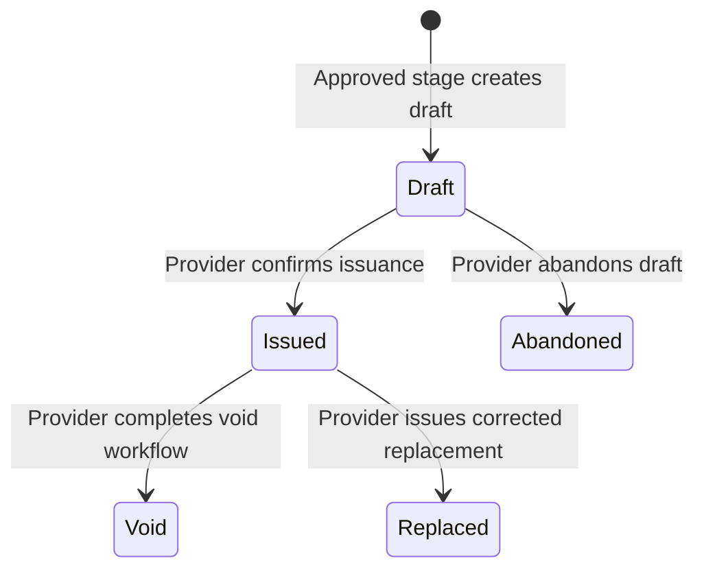
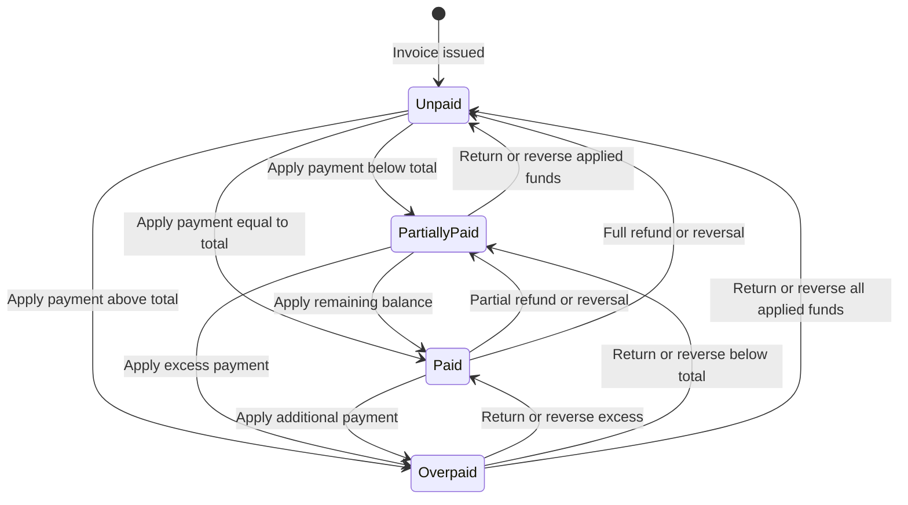

# Invoice and Payment States

**Status:** Draft

**Last updated:** 2026-09-14

## Objective

Define how StagePaid represents an invoice, the money applied to it, and the
events that change its balance without treating billing and payment as one
status.

This document expands the billing model introduced in [Invoice
Trigger](invoice-trigger.md) and [Staged Work Lifecycle](staged-work-lifecycle.md).

## Core decision

StagePaid keeps three related concepts separate:

1. **Invoice document state** describes whether the billing document is a draft,
   issued, or no longer collectible.
2. **Balance state** describes how much valid money is currently applied to the
   invoice.
3. **Payment events** record collections, external payments, reversals, refunds,
   and disputes without rewriting prior history.

For example, an invoice can be **Issued**, **Partially paid**, and **Overdue** at
the same time. Combining those facts into a single status would hide important
information and produce ambiguous transitions.

## Invoice document states

### Draft

The invoice has been prepared from an approved stage but has not been issued to
the client. It may be reviewed and edited within the constraints defined by the
approved stage.

- It is not a payment demand.
- It has no active payment terms.
- It is not payable by the client.
- It may be abandoned by the provider.

### Abandoned

The provider intentionally ended an unissued draft. The draft remains in the
audit history but cannot be issued or receive payments.

Abandoning a draft does not remove or reverse its underlying stage approval. A
later billing attempt must follow an explicit recovery or replacement workflow.

### Issued

The invoice is an official, client-visible billing document.

Issuance fixes the invoice contents as an immutable snapshot, assigns the
official invoice number, establishes the issue and due dates, and makes the
invoice eligible to receive payment.

### Void

The provider invalidated an issued invoice without replacing it in the same
operation. A void invoice remains visible in history but is no longer
collectible.

An invoice with valid applied payments cannot be voided until those funds have
an explicit disposition. The correction workflow is deferred beyond the first
MVP implementation.

### Replaced

The issued invoice was superseded by a corrected invoice. Both records remain
available and link to each other. The replacement receives its own invoice
number and immutable issued snapshot.

Replacement does not silently transfer, refund, or reapply money. Any treatment
of payments on the earlier invoice must be recorded explicitly.

## Invoice correction workflow

Draft invoices may be edited within the approved-stage constraints or abandoned
because they have not been issued. An issued invoice is immutable and can be
corrected only through a recorded correction workflow.

### Correction draft

The provider starts a **Correction draft** from the issued invoice. This creates
an auditable correction event linked to that invoice; it does not edit the
issued snapshot.

The correction draft records:

- correction identifier;
- source invoice identifier and invoice number;
- intended outcome: **Void** or **Replace**;
- required provider explanation;
- proposed corrected fields and their prior values;
- provider identity;
- creation and update timestamps; and
- status: **Draft**, **Completed**, or **Cancelled**.

A replacement correction also prepares a new invoice draft linked to both the
correction event and source invoice. The new draft has no official invoice
number and is not client-visible or payable until issuance.

While a correction draft is active, StagePaid shows **Correction pending** and
temporarily disables new online payment attempts on the source invoice. Cancelling
the correction draft restores payment availability without modifying the source
invoice. The cancelled correction event remains in provider-visible history.

### Eligibility

- An **Issued** invoice with an **Unpaid** balance may be voided or replaced.
- A **Partially paid**, **Paid**, or **Overpaid** invoice requires explicit
  disposition of every applied payment before the correction can complete.
- Pending payment or refund attempts must reach an authoritative outcome before
  correction completes.
- StagePaid does not automatically transfer payments or credits to a replacement
  invoice in the MVP.

### Permitted corrections

The provider may correct administrative or permitted billing information,
including:

- billing name or address;
- invoice description;
- payment terms, issue date, or due date;
- taxes, discounts, or permitted adjustments; and
- client-facing notes.

A correction cannot silently increase the approved stage amount, change the
approved deliverables, or rewrite the underlying approval. Those changes require
the applicable scope-change and approval workflow before a corrected invoice is
issued.

### Void completion

Before confirming a void, StagePaid displays the invoice, reason, balance, and
effect of making it no longer payable. Successful confirmation:

1. records an immutable void event linked to the correction and invoice;
2. changes the invoice document state to **Void**;
3. permanently disables payment on that invoice; and
4. notifies the client.

### Replacement completion

The provider previews the complete corrected invoice and confirms issuance. In
one recoverable, idempotent operation, StagePaid:

1. assigns a new official invoice number to the corrected invoice;
2. issues the new immutable invoice snapshot;
3. changes the source invoice state to **Replaced**;
4. links the source invoice, replacement invoice, and correction event in both
   directions;
5. disables payment on the source invoice; and
6. notifies the client that the replacement is available.

The original invoice number is never reused. Numbering gaps remain visible when
they occur; StagePaid does not renumber later invoices.

The client can view both documents, the correction reason, and which invoice is
currently payable. Internal-only notes and cancelled correction drafts remain
provider-visible.

## Invoice document transitions



`Abandoned`, `Void`, and `Replaced` are terminal document states. StagePaid never
returns the same invoice record to **Draft** or silently edits an issued invoice.

## Amount model

An invoice stores its issued monetary components, including:

- approved stage amount;
- permitted taxes;
- discounts;
- other clearly identified adjustments; and
- final invoice total.

The final invoice total must be greater than zero before issuance. StagePaid
does not issue a zero-total invoice or derive **Paid** merely because nothing is
owed. A zero-dollar stage ends with its approval and completion record unless a
later product decision defines a separate receipt or statement workflow.

The current balance is derived rather than manually selected:

```text
balance due = invoice total - valid applied payment amount
```

Refunds, reversals, and disputes can invalidate or return some of the money that
was previously applied. The implementation must derive the balance from the
financial event ledger rather than overwrite a stored `paid` flag.

## Balance states

### Unpaid

No valid payment amount is applied to the invoice. The balance due equals the
invoice total.

### Partially paid

The valid applied payment amount is greater than zero and less than the invoice
total.

### Paid

The valid applied payment amount equals the invoice total.

### Overpaid

The valid applied payment amount exceeds the invoice total. The excess requires
an explicit disposition. The MVP resolves the excess through a refund or
reversal; unapplied client credit is deferred.

StagePaid does not silently apply excess funds to another invoice, another
stage, or future work.

## Derived payment conditions

These conditions supplement rather than replace the balance state:

- **Overdue:** The invoice is collectible, has a positive balance, and its due
  date has passed.
- **Payment processing:** A payment attempt has started but has not reached a
  successful terminal result.
- **Payment failed:** The most recent relevant attempt failed; the balance was
  not increased.
- **Refund pending:** A requested refund has not reached a successful terminal
  result.
- **Disputed:** A payment processor reports an active dispute or chargeback.
- **Disposition required:** An overpayment or payment on a corrected invoice
  requires provider action.

An unsuccessful or pending payment attempt never changes the amount paid.

## Financial events

### Payment recorded

A successful processor payment or a provider-recorded external payment is
applied to the invoice. The event records at least:

- payment identifier;
- invoice identifier;
- amount and currency;
- source type;
- effective timestamp;
- recording actor;
- processor reference when applicable; and
- idempotency reference.

### External payment recorded

The provider may record a payment received outside StagePaid, such as a check,
cash payment, or bank transfer. The client cannot record or confirm an external
payment in the MVP.

StagePaid clearly labels the entry:

> **Provider recorded—not processed by StagePaid**

The label appears in both provider and client payment history. StagePaid does
not claim to have collected, held, settled, or independently verified the funds.

#### Required information

The provider enters:

- amount and invoice currency;
- date received;
- payment method;
- payer name; and
- confirmation that the payment was received outside StagePaid.

The provider may also add:

- check, transfer, or other reference number; and
- an internal or client-visible note.

StagePaid records the provider identity and system timestamp automatically. A
reference number must not be presented as processor verification.

#### Confirmation

Before applying the entry, StagePaid shows the invoice, entered amount, resulting
balance, and any overpayment. The provider confirms:

> Record **[amount]** as received outside StagePaid? This will update the invoice
> balance and appear in the client's payment history. StagePaid did not process
> or verify this payment.

After confirmation, StagePaid creates an immutable **Payment recorded** event
with an external source type and immediately recalculates the invoice balance.
External payments may be partial.

#### Correction

A recorded external payment cannot be edited or deleted. If the amount, date,
method, payer, or invoice is wrong, the provider records a reversal with a
required reason and then creates a corrected payment entry when appropriate.

The reversal and replacement remain linked to the original event. The client
can see that the earlier entry was reversed, without necessarily seeing an
internal-only correction note.

#### Client notification and visibility

Recording or reversing an external payment notifies the client and adds the
event to the invoice history. The notification identifies:

- provider and project;
- invoice number;
- amount and date received;
- provider-recorded payment method;
- resulting balance; and
- the fact that StagePaid did not process or verify the payment.

The client may contact the provider about an incorrect entry, but StagePaid does
not provide a formal client dispute or confirmation workflow for external
payments in the MVP.

#### Overpayment

If the entry makes the invoice **Overpaid**, StagePaid does not block an otherwise
valid record of money the provider says was received. It shows the excess before
confirmation and marks the invoice **Disposition required** after recording.
StagePaid does not silently move the excess to another invoice or stage.

### Payment reversed

Some or all of a previously recorded payment no longer applies. A reversal does
not mean StagePaid returned money. It records either:

- the correction of a provider-recorded external payment; or
- a processor-confirmed event that invalidated previously applied funds.

A reversal references the original payment and includes its amount, reason,
source, effective timestamp, recording actor or processor, and idempotency
reference. It never deletes or edits the original payment.

For an external-payment correction, only the provider can record the reversal.
The provider must confirm the resulting invoice balance. If the original entry
was incorrect but payment was actually received, the provider creates a new,
corrected external-payment record after the reversal.

A processor-originated reversal is accepted only through an authenticated,
server-verified processor event. It cannot be manually selected by the provider.

### Refund recorded

Some or all captured funds were intentionally returned to the payer. Only the
provider can initiate a refund in the MVP.

For a payment processed through StagePaid, the provider may request a full or
partial refund up to the amount that remains refundable on the originating
payment. The provider must enter a reason and confirm:

- invoice and original payment;
- amount to return;
- expected resulting invoice balance; and
- that a refund can reopen an amount due without changing the invoice document
  state.

A refund request progresses independently through **Pending**, **Succeeded**, or
**Failed**. The invoice balance changes only after the processor confirms that
the refund succeeded. StagePaid then records an immutable refund event linked to
the original payment.

StagePaid cannot electronically refund cash, checks, bank transfers, or other
funds it did not process. The provider returns those funds outside StagePaid and
records an external refund with its date, amount, method, reason, and optional
reference. StagePaid labels the event **Provider recorded—not processed by
StagePaid**.

### Dispute recorded

A dispute or chargeback is created only from an authenticated, server-verified
processor event. Neither the provider nor client can manually assign a payment
the **Disputed** condition.

The dispute is tracked separately from the invoice document and remains linked
to the originating payment. StagePaid records processor updates and displays the
disputed amount and current condition. Whether the funds remain in the valid
applied total depends on the processor's authoritative state.

Detailed evidence submission, representment, deadlines, and dispute-case
management are deferred. The MVP links the provider to the processor's
management experience when action is required.

### Resulting balance and notifications

A successful refund, reversal, or dispute-related loss recalculates the balance
without changing the invoice document from **Issued**. A previously **Paid**
invoice may therefore become **Partially paid** or **Unpaid**.

StagePaid notifies both provider and client when applied funds are successfully
returned, reversed, or removed because of a dispute. The notification identifies
the invoice, event type, amount, resulting balance, and whether StagePaid or the
provider recorded the event. Pending and failed refund requests are visible to
the provider but do not tell the client that funds were returned.

## Payment and balance transitions



## Payment attempt behavior

A payment attempt is not itself a payment. The MVP uses these
processor-independent states:

- **Pending:** StagePaid created the attempt, but the processor has not confirmed
  a result.
- **Action required:** The client must complete an additional authentication or
  payment step.
- **Succeeded:** The processor confirmed successful collection. StagePaid
  creates or recovers exactly one immutable payment record for the attempt.
- **Failed:** Collection failed and no money is applied to the invoice.
- **Cancelled:** The attempt ended before collection and no money is applied to
  the invoice.

The MVP requests immediate collection. It does not provide a separate
authorize-now and capture-later workflow. An authorization by itself never
changes the invoice balance.

- Only a confirmed successful result creates a payment event.
- The server verifies the processor result; a browser or mobile success screen
  is not authoritative.
- Retrying an uncertain request uses the same idempotency reference.
- Retrying after a confirmed failure creates a new attempt and preserves the
  earlier attempt.
- Repeated webhooks or client retries must not apply the same payment twice.
- A delayed processor update may change a derived condition, but it must not
  rewrite invoice history.
- A succeeded attempt does not later become failed. A subsequent loss or return
  of funds is recorded as a separate refund, reversal, or dispute event.

## Payment-attempt notification policy

StagePaid gives the client immediate help while giving the provider prompt,
privacy-safe visibility without sending an alert for every retry. A failed,
cancelled, or action-required attempt never implies that the client is unwilling
or unable to pay.

### Notification principles

- The client receives immediate, actionable status for their own attempt.
- The provider dashboard reflects the invoice's current payment condition
  immediately.
- Provider messages describe the invoice and outcome without exposing private
  decline reasons or unnecessary payment details.
- StagePaid aggregates related attempts into one unresolved payment session and
  avoids sending one alert per retry.
- A later successful payment cancels any scheduled unresolved-payment alert.
- Notifications report financial state; they never direct the provider to stop
  work or take contractual action.

### Card and immediate-payment attempts

When a card or other immediate-payment attempt requires action, fails, or is
cancelled:

1. StagePaid immediately tells the client what they can safely do next.
2. The provider dashboard immediately shows **Payment not completed** without a
   disruptive outbound notification.
3. StagePaid starts a 15-minute grace period for the invoice's unresolved
   payment session.
4. A successful replacement payment during the grace period cancels the
   provider alert and produces the normal successful-payment notification.
5. If no successful payment resolves the session within 15 minutes, StagePaid
   sends the provider one **Payment not completed** notification.

Additional failed attempts during the same grace period update the operational
history but do not restart the timer or create additional provider alerts. After
an alert is sent, StagePaid does not repeatedly notify the provider for the same
session unless a materially new event or a separately scheduled invoice reminder
occurs.

The 15-minute period is a notification grace period, not deletion or expiration
of the attempt record.

Suggested provider copy:

> A payment attempt for invoice **[invoice number]** was not completed. The
> client has been prompted to retry. The invoice remains **[balance state]**.

### Privacy-safe failure information

The client may receive processor-approved guidance needed to correct their own
attempt. The provider does not receive:

- a processor decline code;
- the specific decline or authentication reason;
- full card or bank details;
- a bank balance or credit-related inference; or
- client-entered information that is not already approved for masked display.

The provider may see the method category and processor-supplied masked details
that StagePaid is permitted to display.

### ACH notifications

ACH timing is not governed by the 15-minute grace period because delayed
settlement can be normal.

- When the bank payment is submitted, StagePaid immediately tells both parties
  **Bank payment submitted—processing** and leaves the invoice balance unchanged.
- The provider dashboard shows the processor's current status and expected
  timing when available.
- A server-confirmed success notifies both parties and recalculates the balance.
- A server-confirmed failure or return notifies both parties promptly and shows
  the resulting balance.
- A pending ACH attempt triggers a provider follow-up only after the expected
  processor window or a separately configured operational threshold has passed.

StagePaid does not promise a settlement date that the processor has not supplied
or confirmed.

### Successful payments

A server-confirmed successful payment notifies both provider and client
immediately. The notification and receipt include the invoice, amount, date,
method category, masked display details when permitted, and resulting balance.

### Refund attempts

Pending and failed refund requests notify the provider immediately because the
provider initiated the action and may need to intervene. The client is notified
when the processor authoritatively confirms a successful refund. The message
says that the refund was issued and presents processor-supplied arrival timing
when available; it does not claim the client's bank has posted the funds.
StagePaid does not tell the client that a failed or merely pending refund was
completed.

### Delivery, deduplication, and audit

The MVP uses in-application status and email for required notifications. Native
push and SMS are deferred.

Every outbound notification records its event reference, intended recipient,
template version, channel, scheduled time, delivery attempt, and delivery
outcome. Notification processing is idempotent: repeated processor events,
retries, or worker execution cannot send duplicate messages for the same
notification obligation.

Email delivery failure does not change the invoice, attempt, or payment state.
The in-application history remains the authoritative user-facing status.

## Online payment methods

StagePaid uses Stripe Connect as the MVP online payment processor. Online
payments are made toward a specific issued invoice and are credited to the
provider's connected account according to the platform's payment configuration.

### Included

- **Credit and debit cards:** The primary immediate-payment method.
- **ACH bank payments:** A lower-cost option appropriate for larger contractor
  invoices, subject to processor eligibility and availability.

Checks, cash, and bank transfers completed outside StagePaid use the
provider-recorded external-payment workflow. They are not online payment methods
processed by StagePaid.

### Deferred

- Apple Pay and Google Pay
- Buy now, pay later and third-party financing
- Wire transfers processed through StagePaid
- Additional regional payment methods
- Cryptocurrency

The payment-method interface must not display a method that is unavailable for
the provider, client, currency, amount, or jurisdiction.

## Card behavior

StagePaid requests immediate collection of the outstanding balance. A card
payment changes the invoice balance only after Stripe reports successful
collection through a server-verified result.

Declines and incomplete authentication leave the invoice balance unchanged and
provide the client a safe retry path. A retry after a confirmed failure creates
a new attempt rather than rewriting the failed one.

## ACH behavior

An accepted ACH submission is not a successful payment. ACH may require account
authorization and can remain unsettled while the bank and processor complete
their work.

- The invoice shows **Payment processing** while the outcome is pending.
- Pending ACH funds do not reduce the balance or mark the invoice **Paid**.
- StagePaid applies the payment only after Stripe confirms success through an
  authenticated server event.
- A failed or returned ACH payment leaves or restores the appropriate balance
  and preserves the attempt and processor events in history.
- StagePaid prevents an ordinary duplicate online payment while an attempt for
  the full balance is actively processing, while still handling races and
  processor events idempotently.

Client-facing copy must distinguish **Bank payment submitted** from **Payment
received**.

## Payment-data security boundary

Stripe-hosted or Stripe-provided payment components collect card and bank
credentials. Sensitive payment credentials must not pass through StagePaid's
application server or be written to its database, logs, analytics, error
reports, support tools, or notifications.

StagePaid stores only the minimum operational and display-safe information
needed to associate and explain a transaction, such as:

- Stripe customer, connected-account, payment, and payment-method references;
- payment method type;
- card brand and last four digits when supplied for display;
- bank name and masked account details when supplied for display;
- invoice identifier, amount, currency, and timestamps; and
- processor outcome and reconciliation references.

StagePaid never stores:

- full card numbers;
- card security codes;
- full bank account or routing numbers;
- online-banking credentials; or
- unredacted payment credentials in free-text fields.

All processor callbacks are authenticated and handled on the server. The system
uses transport encryption, limits payment data by role, protects secrets outside
the source repository, and redacts sensitive values from logs. Using Stripe
reduces the sensitive data StagePaid handles but does not remove StagePaid's
responsibility to follow applicable security, privacy, and payment-industry
requirements.

## Fees, refunds, and provider settlement

The client invoice balance and provider settlement are separate calculations. A
successful payment applies the client's full payment amount to the invoice even
when Stripe and StagePaid deduct fees before the provider's payout.

StagePaid does not add an automatic card surcharge, convenience fee, or other
payment-method fee to the client invoice in the MVP. Any future fee pass-through
requires separate product, contractual, card-network, tax, and jurisdictional
review.

### Provider disclosure

Before accepting payments, the provider must accept an agreement that clearly
states:

- how the StagePaid platform fee is calculated;
- that Stripe processing and related fees are separate;
- which party bears processing, refund, dispute, and currency-conversion costs;
- how StagePaid's fee is treated after a refund, reversal, or dispute loss; and
- where the provider can review transaction and payout records.

The applicable StagePaid fee is also shown before the provider enables payment
collection and in the ledger for every transaction. A fee change applies only
after the notice and acceptance required by the provider agreement and
applicable law.

### StagePaid platform fee

The MVP uses a **1% percentage-only transaction fee** on payments processed
through StagePaid. Provider-recorded external payments do not incur a StagePaid
transaction fee because StagePaid did not process them.

StagePaid earns its fee only on the portion of a payment the provider ultimately
retains:

- a full client refund returns the full StagePaid fee;
- a partial client refund returns the same percentage of the StagePaid fee;
- a payment completely reversed or lost through a dispute reverses the full
  StagePaid fee;
- a partial reversal or dispute loss reverses the fee proportionally; and
- a dispute resolved in the provider's favor does not reverse the fee merely
  because the payment was temporarily disputed.

Stripe does not automatically return a Connect application fee with every
refund. StagePaid explicitly requests the appropriate full or proportional
application-fee refund and records its authoritative result.

Calculations use integer minor units. Each proportional return rounds according
to one documented rule, and the final full disposition returns any remaining
StagePaid fee so cumulative fee returns never exceed or fall short of the
original fee.

### Stripe and other processor fees

Stripe's original payment-processing, Connect, and currency-conversion fees may
remain charged after a refund. Some payment methods, account pricing agreements,
or regions may also impose a refund or dispute fee. StagePaid reads actual fees
from Stripe rather than estimating them as authoritative amounts.

Processor-retained or newly assessed fees are provider expenses under the MVP
commercial model. They do not reopen the client invoice balance or reduce the
amount shown on the client's refund receipt. Every such fee is itemized in the
provider ledger.

### Provider ledger

For each payment and later disposition, the provider can see:

- gross client payment;
- Stripe processing and related fees;
- StagePaid platform fee;
- client refunds;
- returned StagePaid fee;
- reversals, disputes, and separately assessed fees;
- net provider proceeds; and
- payout status and processor references.

The client sees the invoice amount, their payments, their refunds, and the
resulting balance. The client does not see the provider's private processing
costs, StagePaid fee, or net payout.

The following ledgers illustrate the MVP's 1% StagePaid fee. Stripe amounts are
examples; the authoritative amount comes from the provider's Stripe ledger.

#### Successful payment

```text
Gross client payment                  $5,000.00
Stripe processing fee                  -$145.30
StagePaid platform fee (1%)              -$50.00
Provider net proceeds                  $4,804.70
Client amount applied to invoice       $5,000.00
```

#### Twenty-five-percent client refund

```text
Original gross client payment          $5,000.00
Client refund (25%)                    -$1,250.00
Original StagePaid fee                    $50.00
StagePaid fee returned (25%)               $12.50
StagePaid fee retained                     $37.50
Original Stripe processing fee            $145.30
Stripe processing fee returned               $0.00
Client payment retained                $3,750.00
Provider net retained                  $3,567.20
```

The provider's actual net position also reflects Stripe's authoritative refund
and settlement entries. The invoice balance is recalculated from the client
payment and refund amounts, not from provider fees.

#### Full client refund

```text
Original gross client payment          $5,000.00
Client refund                          -$5,000.00
StagePaid fee returned                    $50.00
StagePaid fee retained                     $0.00
Original Stripe processing fee            $145.30
Stripe processing fee returned               $0.00
Provider's remaining processing cost     -$145.30
Client amount retained                       $0.00
```

If Stripe reports different fee behavior for the provider's payment method,
region, or pricing agreement, the ledger displays those actual entries instead
of the illustrative values above.

## Financial-record retention and export

StagePaid uses a seven-year baseline retention period for finalized financial
records in its U.S.-first MVP. This is a product-policy baseline subject to
legal, tax, accounting, and jurisdictional review before launch; it is not a
claim that one period satisfies every legal requirement.

The retention period begins after the later of:

- the invoice's final financial event; or
- the associated project's closure date.

StagePaid retains these records during the applicable period:

- issued, void, and replaced invoice snapshots;
- invoice correction events;
- payments and provider-recorded external payments;
- payment reversals, refunds, and disputes;
- Stripe and StagePaid fee entries;
- invoice balance and provider settlement entries;
- payout and reconciliation references; and
- the actors, timestamps, currencies, and relationships needed to explain the
  financial history.

Records remain immutable: a later correction adds a linked event and never
silently rewrites earlier history.

### Extensions and deletion

StagePaid retains a record beyond seven years when a legal hold, unresolved
dispute, tax or reporting obligation, court order, agreement, or applicable
jurisdiction requires it. The reason and applicable scope are access-controlled
and auditable.

Closing a provider account or ending a passwordless client's access does not
immediately delete financial records still within their retention period.
StagePaid minimizes or removes profile, session, analytics, support, and
operational data that is no longer needed and is not part of a required record.

When no retention purpose remains, StagePaid securely deletes or irreversibly
anonymizes the record according to a documented disposal process. Where
practical, StagePaid gives the affected user notice and an opportunity to export
their records before ordinary deletion.

### Export

The provider can export:

- a CSV financial ledger containing invoice, payment, fee, refund, reversal,
  dispute, balance, and payout entries; and
- PDF copies of issued invoices, corrections, and payment or refund receipts.

The client can export PDF copies of invoices, corrections, and receipts relevant
to them. A client export does not expose the provider's Stripe costs, StagePaid
fees, internal notes, net proceeds, or unrelated records.

Exports include stable identifiers, timestamps, amounts, currency, source type,
and links or references needed to reconcile related events. Generated exports
are point-in-time copies; later events appear in a newly generated export rather
than modifying a previously downloaded file.

### Account closure access

Before ordinary account closure, StagePaid prompts the provider to download
their financial records. During the required retention period, StagePaid
maintains a documented process for an authorized former user to request records
they are legally entitled to receive, subject to identity verification and
privacy boundaries.

## Policy transparency and acknowledgement

Internal product specifications are not themselves presented as legal terms.
Before enabling payment collection, a provider receives concise disclosures and
links to the current:

- provider terms;
- privacy notice;
- fee schedule and refund treatment;
- payment-processing terms; and
- financial-record retention and export policy.

StagePaid records the provider identity, timestamp, document versions, and
affirmative acceptance required for account creation or payment enablement. A
material change receives appropriate notice and renewed acknowledgement when
required.

A client does not need to create a permanent StagePaid account. Before a client
takes a consequential action such as submitting a payment, StagePaid presents
the relevant client terms, privacy notice, payment authorization, refund
information, and retention summary with persistent links. StagePaid records the
client's affirmative acknowledgement with the action, confirmed identity,
timestamp, and document versions.

Policy links remain available in the application footer or similarly consistent
location, in the client review and payment experience, and from relevant
receipts. The links must be readable before acceptance and must not rely on
preselected consent, hidden text, or an account existing later.

Acknowledgement does not replace any separate consent, notice, signature, or
other process required by law or the underlying contractor-client agreement.

## Partial and multiple payments

The domain model supports more than one payment event per invoice so that
partial payments, retries, and mixed payment sources remain representable.

For the first MVP interface, the primary client action is **Pay balance**. The
client cannot intentionally enter a smaller online payment amount. StagePaid can
still represent a partial balance when it results from a provider-recorded
external payment, a refund, a reversal, a dispute, or an exceptional processor
event.

Supporting a correct multi-payment data model does not require an intentional
partial-payment workflow to ship in the first release.

## Overpayment handling

When an invoice becomes **Overpaid**, StagePaid:

1. preserves the successful payment record;
2. shows the invoice total, amount paid, and excess separately;
3. applies the prominent derived condition **Disposition required**;
4. disables additional payment attempts on the invoice;
5. notifies both provider and client;
6. prevents silent allocation of the excess; and
7. records the eventual refund or reversal.

If StagePaid processed the excess, the provider returns it through the refund
workflow. If the excess came from an external payment, the provider returns the
money outside StagePaid and records an external refund. The invoice remains
**Overpaid** with **Disposition required** until a successful refund or reversal
reduces the valid applied amount.

When the disposition is complete, StagePaid recalculates the balance:

- an applied amount equal to the invoice total becomes **Paid**;
- an applied amount between zero and the invoice total becomes **Partially
  paid**; and
- an applied amount of zero becomes **Unpaid**.

The fixed **Pay balance** action prevents an ordinary client from intentionally
overpaying online. StagePaid must still handle simultaneous attempts, duplicate
real-world payments, exceptional processor events, and provider-recorded
external payments without hiding money that was actually received.

Holding an unapplied client credit is deferred until its accounting, legal, and
processor requirements are defined. StagePaid does not apply the excess to
another invoice, stage, or future project in the MVP.

## Refund and reversal rules

- A refund or reversal must reference an existing payment.
- The amount cannot exceed the eligible amount remaining on that payment.
- The event records the actor, reason, amount, timestamp, and processor
  reference when applicable.
- A requested refund changes the balance only after its authoritative success
  result.
- Returning money does not erase the invoice, payment, stage approval, or audit
  history.
- Refunding a paid invoice can return its balance to **Partially paid** or
  **Unpaid**.
- **Refunded** is not an invoice document state.

## Currency and precision

- Every invoice and financial event has an explicit ISO currency code.
- All calculations use integer minor units or an equivalent exact decimal
  representation; binary floating-point values are not used for money.
- Payments applied to an invoice must use the invoice currency.
- Multi-currency invoices, conversion, and foreign-exchange gains or losses are
  outside the MVP.

## Provider and client experience

The provider sees:

- invoice document state;
- invoice total, amount paid, balance due, and any excess;
- due date and overdue condition;
- chronological payment, refund, reversal, and dispute events;
- whether an external payment was provider-recorded; and
- required corrective action.

The client sees:

- the immutable issued invoice;
- invoice total and current balance due;
- payment instructions and available payment action;
- successful payments and refunds relevant to them; and
- clear pending or failed messages that do not imply money was received.

## Invariants

- Only an **Issued** invoice is payable.
- An invoice must have a total greater than zero before it can be issued.
- Issued invoice contents are immutable.
- Invoice document state and balance state are stored or derived independently.
- Payment attempts do not count toward the amount paid.
- Each processor event is handled idempotently.
- A financial event is append-only and cannot be silently deleted or rewritten.
- Every refund, reversal, and dispute references its originating payment.
- The balance is derived from the invoice total and valid applied financial
  events.
- An overpayment always remains visible until explicitly resolved.
- Money is never silently moved between invoices, stages, projects, or clients.
- Project completion does not imply invoice payment, and invoice payment does
  not retroactively create stage approval.

## MVP boundary

### Included

- Separate invoice document and balance states
- One invoice currency
- Full outstanding-balance payment through the primary online flow
- Credit and debit card payments through Stripe Connect
- ACH bank payments with pending settlement represented accurately
- Provider-recorded external payments
- Correct representation of partial and multiple payments arising outside the
  primary client payment flow
- Overdue as a derived condition
- Refund and reversal event history
- Provider-initiated full and partial refunds for processed payments
- Provider-recorded external refunds
- Processor-originated reversal and dispute visibility
- Overpayment detection and explicit disposition requirement
- Idempotent processor event handling
- Processor-hosted collection of sensitive payment credentials
- Separate client-balance and provider-settlement ledgers
- Proportional return of the StagePaid fee after refunds, reversals, and dispute
  losses
- Auditable void and replacement corrections for issued invoices
- Seven-year financial-record retention baseline with legal-hold extensions
- Provider CSV ledger exports and provider/client PDF document exports
- Versioned provider and passwordless-client policy acknowledgements
- Privacy-safe, deduplicated payment-attempt notifications with a 15-minute
  provider grace period for unresolved immediate-payment sessions
- Client- and provider-visible payment history

### Deferred

- Stored client credit and automatic credit application
- Client-selected partial payments and split tender (**target: 1.1.0**)
- Partial-payment agreements and scheduled installments (**target: 1.1.0**)
- Separate authorization and delayed capture
- Combining or splitting stage invoices
- Multi-currency payments and conversion
- Automated collections and late fees
- Client payment-method surcharges and fee pass-through
- Credit notes and advanced accounting exports
- Complex dispute-management tooling
- Apple Pay, Google Pay, financing, wire transfers, and additional regional
  online payment methods
- Native push and SMS payment notifications
- Escrow or custody of project funds

## Acceptance criteria

- The specification distinguishes invoice document state, balance state, and
  payment events.
- Every invoice state and allowed transition is defined.
- A zero-total draft cannot be issued or appear as a paid invoice.
- The balance is calculated from exact monetary values and immutable events.
- Pending and failed attempts cannot make an invoice appear paid.
- Succeeded attempts create exactly one payment record, even after retries or
  duplicate processor notifications.
- Partial payments, refunds, reversals, disputes, and overpayments have defined
  behavior.
- An overpaid invoice blocks additional payments and displays **Disposition
  required** until a refund or reversal resolves the excess.
- Both parties can see the invoice total, amount paid, excess, and resulting
  disposition event.
- Only the provider initiates refunds, and only processor-confirmed successful
  refunds change the balance.
- StagePaid never claims to electronically refund funds it did not process.
- Processor reversals and disputes originate only from authenticated server
  events.
- Successful refunds, reversals, and dispute-related losses recalculate the
  balance without changing the invoice document state.
- The primary client payment action requests the full outstanding balance and
  does not accept a client-selected partial amount.
- Overdue can coexist with an unpaid or partially paid balance.
- Issued invoices and recorded financial history cannot be silently changed.
- Every issued-invoice correction has a linked correction event and required
  reason; the original invoice snapshot remains immutable.
- A replacement receives a new invoice number and links bidirectionally to the
  original invoice and correction event.
- An invoice with applied funds cannot be voided or replaced until those funds
  have an explicit disposition.
- An active correction draft prevents new online payment attempts on the source
  invoice without changing its issued snapshot.
- Duplicate requests or processor notifications cannot apply money twice.
- Card and ACH credentials are collected by Stripe-provided components and are
  never stored by StagePaid.
- A pending ACH submission remains **Payment processing** and does not reduce
  the invoice balance.
- Client copy distinguishes a submitted bank payment from confirmed receipt.
- Provider fee terms are disclosed before payment collection is enabled and
  every transaction itemizes Stripe fees, the StagePaid fee, and net proceeds.
- A refund, reversal, or dispute loss returns the StagePaid fee in the same
  proportion as the payment amount returned or lost.
- Provider fees never change the amount applied to the client invoice.
- Required financial records remain immutable and available under the
  seven-year baseline even after account closure.
- Provider CSV and PDF exports reconcile related events without exposing
  another party's private financial details.
- Policy acknowledgement records identify the actor, timestamp, and accepted
  document versions.
- Clients receive immediate attempt guidance, while providers receive one alert
  only when an immediate-payment session remains unresolved after 15 minutes.
- ACH submission, success, failure, and return messages accurately distinguish
  processing from received funds.
- Provider notifications never expose private decline details or imply that work
  must stop.
- Duplicate events and retries cannot produce duplicate notification
  obligations.
- External payments are distinguishable from processor-verified payments.
- Only the provider can record an external payment in the MVP.
- Recording an external payment requires its amount, received date, method,
  payer name, and provider confirmation.
- External-payment corrections preserve the original entry through a reversal
  and, when necessary, a new corrected record.
- The client can see and is notified of external payment and reversal events,
  including the fact that StagePaid did not process or verify them.
- MVP inclusions and deferred accounting features are explicit.

## Planned follow-up: 1.1.0

Version 1.1.0 is intended to introduce partial-payment agreements. That work
should define how a provider and client agree to permitted partial amounts or a
payment schedule, how installments become due, and how the agreement relates to
the original issued invoice without rewriting it.

The MVP's multi-payment event model and derived balance states are designed to
support this addition, but this document does not yet commit to its interface or
detailed rules.
