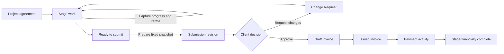
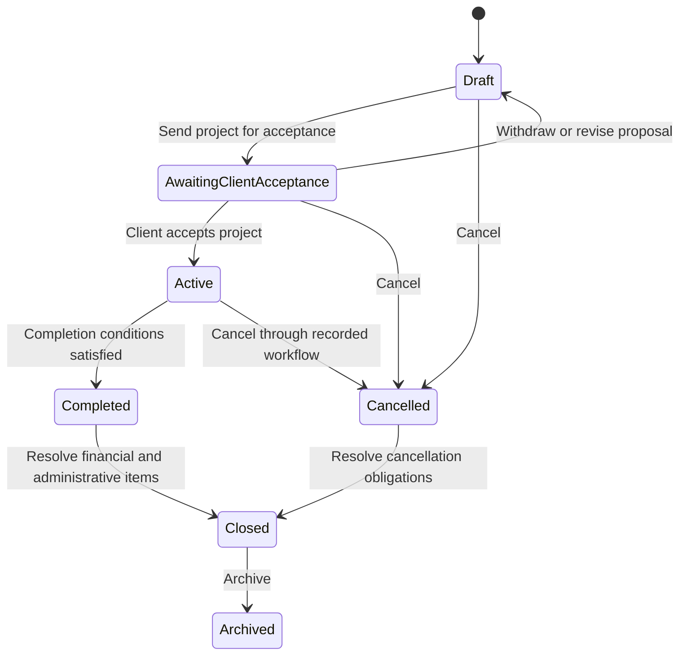
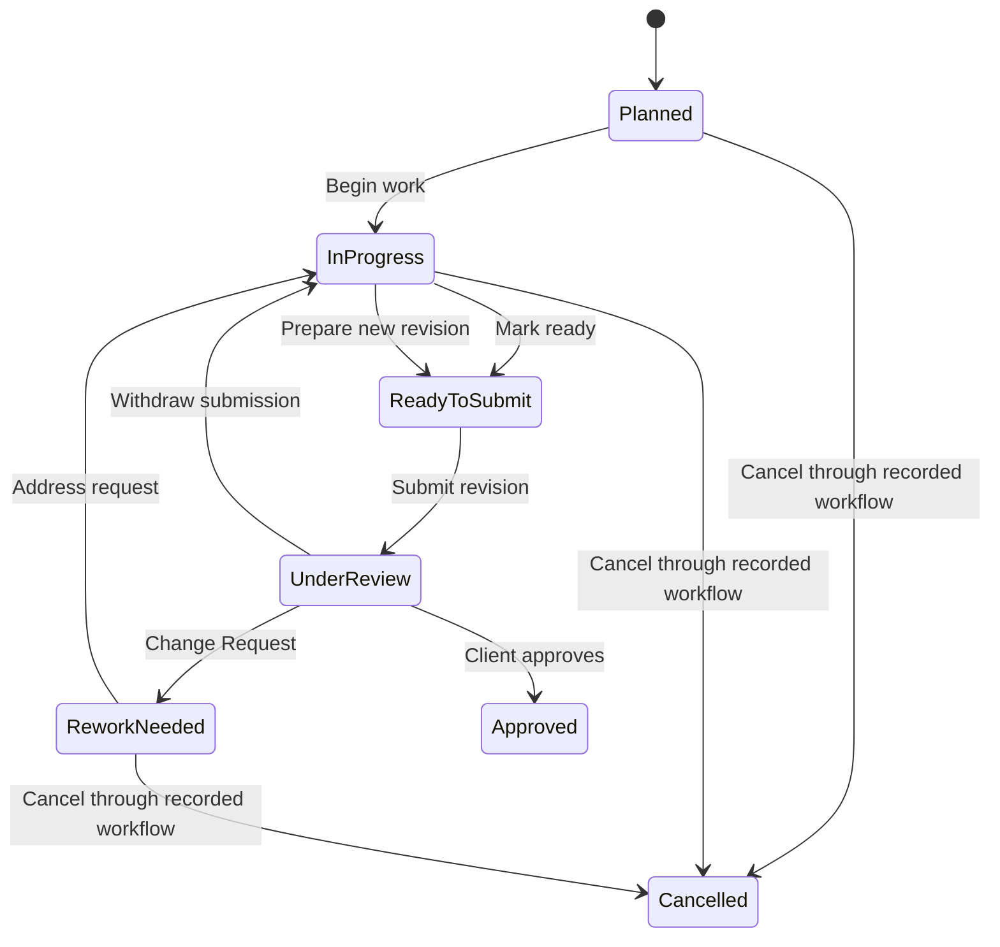
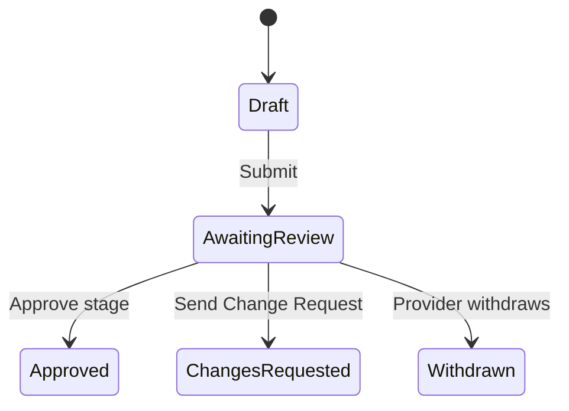
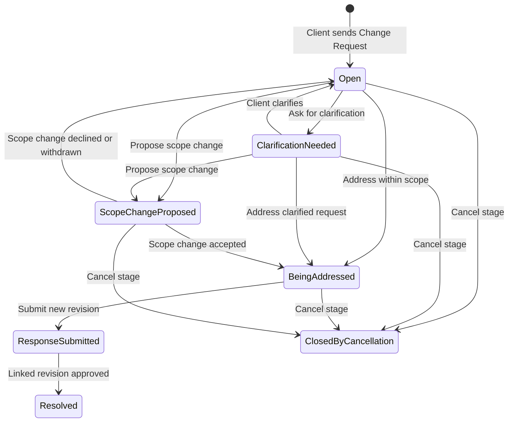
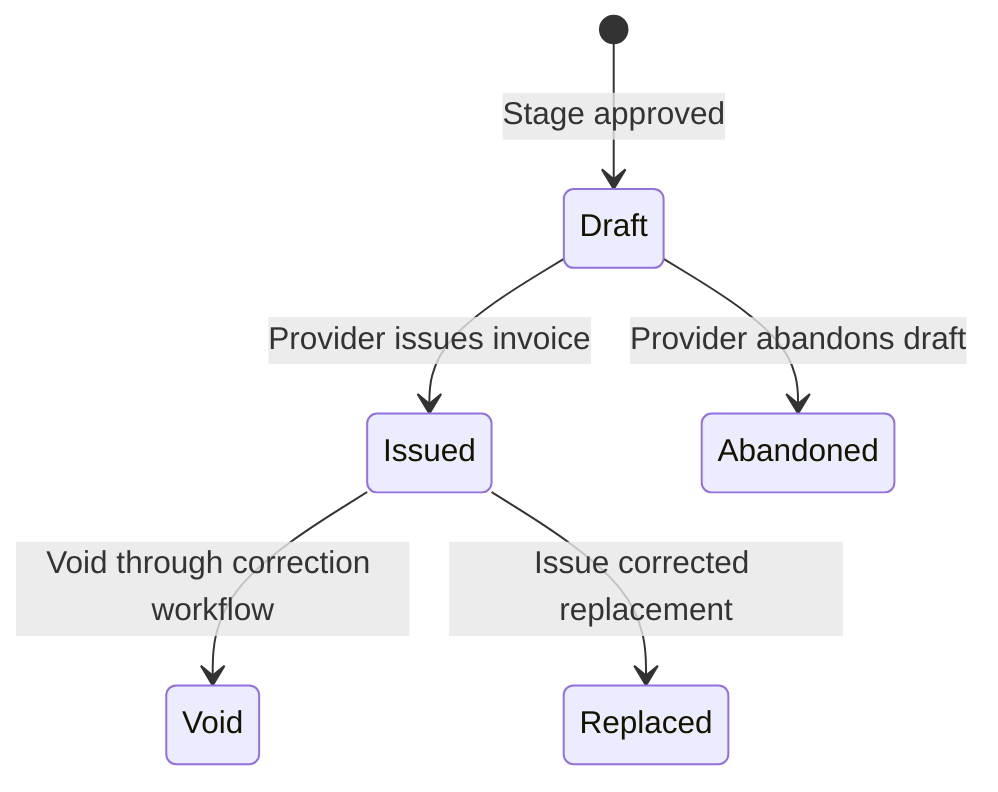
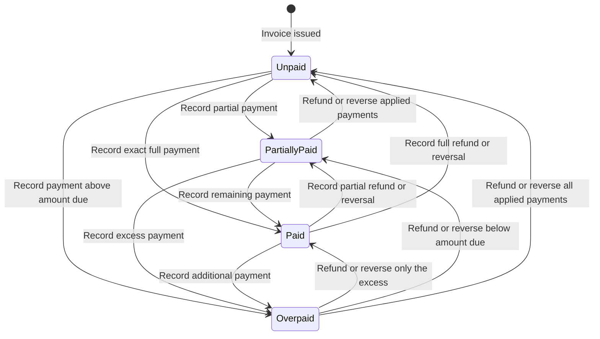

# Staged-Work Lifecycle

**Status:** Draft

**Last updated:** 2026-09-13

## Objective

Define how a StagePaid project moves from initial setup through documented work,
client review, invoicing, and payment without using one overloaded status to
represent several independent facts.

## Core decision

StagePaid models work, review, Change Requests, billing, and payment as related
but distinct lifecycles.

For example, a stage may simultaneously be:

- complete from the provider's perspective;
- approved from the client's perspective;
- invoiced from the billing perspective; and
- unpaid from the payment perspective.

The interface may present a concise overall summary, but that summary is derived
from authoritative lifecycle states. It is not an independently editable status.

## Lifecycle overview

This diagram shows the ordinary path, not every exception. Withdrawal,
clarification, scope change, invoice correction, cancellation, and refund remain
explicit recorded events rather than shortcuts around the lifecycle.

## Domain records

### Project

The client-provider engagement containing agreed stages, participants, activity,
and the shared project-level record.

### Stage

A defined portion of the project with its own description, acceptance criteria,
amount, expected timing, work state, and related review and billing records.

### Submission revision

An immutable snapshot of a provider's completion summary, evidence, deliverables,
and applicable agreement context submitted for client review.

### Change Request

An immutable client decision that returns a submission to the provider with one
required overall message and optional evidence-specific notes.

### Scope change

A separately proposed and accepted modification to agreed work, amount, schedule,
or acceptance criteria. Identifying a potential scope change does not create one.

### Approval

An immutable client decision accepting one submission revision as completing its
stage for StagePaid workflow purposes.

### Invoice

A billing record linked to an approved stage and submission. Approval prepares a
draft; explicit provider issuance creates the client-facing invoice.

### Payment activity

A record of money collected, recorded, refunded, reversed, or otherwise applied
to an issued invoice. Detailed payment behavior will be defined separately.

## Project lifecycle

### States

- **Draft:** The provider is defining participants, stages, amounts, and terms.
- **Awaiting client acceptance:** The proposed project structure is available for
  client review.
- **Active:** The governing project structure has been accepted and work may
  progress.
- **Completed:** Required stages have reached their completion conditions and no
  unresolved project work remains. Completion does not imply that every invoice
  has been paid.
- **Cancelled:** The project ended before ordinary completion through a recorded
  cancellation workflow.
- **Closed:** The project is completed or cancelled, all billing and credit
  conditions are resolved, and no administrative action remains.
- **Archived:** The closed project is removed from active working views without
  deleting its record.

### Primary transitions

Project acceptance and cancellation require dedicated product decisions. These
states establish lifecycle boundaries without yet defining those experiences.

### Completion conditions

A project may become **Completed** when:

- every required stage is approved or ended through an accepted cancellation or
  scope-change outcome;
- no submission is awaiting review;
- no Change Request remains open, awaiting clarification, being addressed, or
  awaiting a client decision on its response; and
- no required stage remains planned, in progress, or ready to submit.

Outstanding invoices, partial payments, overdue balances, and overpayments do not
prevent operational completion. They remain visible through the independent
billing and payment lifecycles.

### Financial condition

The project may derive a separate financial condition from its invoices and
payment activity:

- **Not yet billed:** Approved work remains in draft billing.
- **Balance due:** One or more issued invoices have a positive balance.
- **Financially settled:** No issued invoice has a positive balance and no
  overpayment requires disposition.
- **Credit or refund action needed:** Excess funds or another financial correction
  requires attention.

This condition never replaces the project lifecycle state. A project may be
**Completed** and **Balance due** at the same time.

The project becomes **Closed** only after it is completed or cancelled and its
financial condition is **Financially settled**, with no remaining credit, refund,
or administrative action.

### Cancellation and archival

Cancelling a project stops its ordinary work progression but does not silently
cancel stages, withdraw submissions, void invoices, reverse payments, or erase
history. The cancellation workflow must state how each open item will be handled:

- approved and completed stages retain their records;
- unstarted stages may be cancelled;
- active stages require an explicit disposition, including any agreed partial
  completion or amount;
- awaiting submissions require a recorded withdrawal or other terminal outcome;
- draft invoices require an explicit abandonment decision;
- issued invoices require an explicit retain, correct, replace, or void decision;
  and
- received payments remain recorded unless a separate refund or reversal is
  authorized.

Cancellation itself never promises or initiates a refund. Refund entitlement and
amount depend on the agreement and recorded cancellation decisions.

Archival changes working-list visibility, not business state. A project can be
archived only after it is **Closed** and through an explicit action. Archiving
does not imply deletion.

## Stage work lifecycle

### States

- **Planned:** The stage exists in the active project but work has not begun.
- **In progress:** Work on the stage has started.
- **Ready to submit:** The provider considers the work complete enough to prepare
  a client submission.
- **Under review:** A submission revision is awaiting a client decision.
- **Rework needed:** A Change Request requires provider attention.
- **Approved:** A client approved the current submission revision.
- **Cancelled:** The stage ended through a recorded cancellation or accepted
  scope-change workflow.

### Primary transitions

The stage's work state does not become **Invoiced** or **Paid**. Those facts belong
to the billing and payment lifecycles.

## Submission lifecycle

Submission begins only after the provider considers the stage work ready for
review. Work completion and iteration belong to the stage-work lifecycle above;
the submission lifecycle governs the fixed review record created from that work.

### States

- **Draft:** Editable submission content not yet available to the client.
- **Awaiting review:** An immutable submitted revision awaiting one client
  decision.
- **Approved:** The client approved this revision.
- **Changes requested:** The client created a Change Request for this revision.
- **Withdrawn:** The provider withdrew this revision before a client decision.

Approval, changes requested, and withdrawal are mutually exclusive terminal
states for a submitted revision.

### Revision relationship

Every submission receives a monotonically increasing stage revision number. A
new revision may follow a Change Request or withdrawal, but does not overwrite or
reactivate the earlier revision.

“Superseded” is a display relationship, not an authoritative submission state. An
older terminal revision may be shown as superseded when a newer revision exists,
while retaining the actual event that ended it.

### Primary transitions

The first durably recorded terminal event wins. Concurrent attempts return the
existing result rather than creating contradictory records.

## Change Request lifecycle

The Change Request itself is an immutable decision record with a related response
state.

### Response states

- **Open:** The provider has not yet selected a response path.
- **Clarification needed:** The provider asked the client for more information.
- **Being addressed:** The provider is treating the request as work within the
  existing scope.
- **Scope change proposed:** The provider linked a separate proposed scope change.
- **Response submitted:** A new submission revision responds to the request and
  awaits the client's review.
- **Resolved:** The client approved the linked response revision.
- **Closed by stage cancellation:** A later recorded cancellation ended the stage
  without resubmission.

Changing the response state never rewrites the client's original message or
evidence notes.

If the client sends another Change Request on the response revision, StagePaid
creates a new CR identifier. The earlier Change Request remains **Response
submitted** and links to the newer request; only client approval marks it
**Resolved**.

### Primary transitions

The scope-change and stage-cancellation workflows remain open product decisions.

## Review lifecycle

The active review state is derived from the current submission and decision:

- **Not submitted:** No revision is awaiting review.
- **Awaiting review:** The current revision is available for a client decision.
- **Changes requested:** The latest client decision returned the work.
- **Approved:** The latest submitted revision was approved.
- **Withdrawn:** The latest awaiting revision was withdrawn and no newer revision
  exists.

Only one submission revision per stage may be **Awaiting review** at a time.

## Billing lifecycle

### Stage billing readiness

- **Not ready:** No eligible approval exists.
- **Ready for billing:** Approval exists and its draft invoice is available.
- **Invoiced:** The linked invoice has been issued.

### Invoice document states

- **Draft:** Prepared for provider review but not issued to the client.
- **Abandoned:** The provider ended a draft without issuing it.
- **Issued:** The official invoice exists and payment terms have begun.
- **Void:** The issued invoice was invalidated through a recorded action.
- **Replaced:** A corrected invoice was issued and linked to this one.

### Balance states

- **Unpaid:** No valid payment is currently applied to the amount due.
- **Partially paid:** Valid payments are greater than zero and less than the
  amount due.
- **Paid:** The valid payments equal the amount due.
- **Overpaid:** Valid payments exceed the amount due and the excess requires a
  recorded refund, reversal, or credit decision.

**Overdue** is a derived condition applied when an issued invoice has a positive
balance after its due date. It does not replace the balance state; an invoice may
be both **Partially paid** and **Overdue**.

### Payment events

- **Payment recorded:** Money was successfully collected or a provider recorded
  an external payment.
- **Payment reversed:** A previously recorded payment no longer applies.
- **Refund recorded:** Some or all received money was returned.

Payment and refund records are immutable financial events. Their valid totals
derive the invoice balance; **Refunded** is not used as a replacement invoice
state. StagePaid must not silently apply an overpayment to another invoice or
future stage.

### Primary transitions

The first diagram represents the invoice document. The second represents its
derived balance. The detailed correction, refund, reversal, and reconciliation
rules remain an open product decision.

## Derived stage summary

The interface may calculate one plain-language summary using the most actionable
current condition. A possible precedence is:

1. **Cancelled**
2. **Changes requested**
3. **Awaiting client review**
4. **Invoice overdue**
5. **Refund or credit decision needed**
6. **Payment due**
7. **Invoice draft ready**
8. **Work in progress**
9. **Ready to submit**
10. **Planned**
11. **Paid**

This ordering is a usability hypothesis, not an authoritative state machine. The
underlying state remains visible when the summary could hide important context.

## End-to-end happy path

1. Provider creates a draft project with stages, amounts, and acceptance
   criteria.
2. Client accepts the project structure.
3. Project becomes **Active** and the first stage is **Planned**.
4. Provider begins work; the stage becomes **In progress**.
5. Provider prepares completion evidence; the stage becomes **Ready to submit**.
6. Provider submits revision 1; the stage becomes **Under review** and the
   submission becomes **Awaiting review**.
7. Client approves revision 1; the stage becomes **Approved**.
8. StagePaid creates one **Draft** invoice and marks the stage **Ready for
   billing**.
9. Provider reviews and issues the invoice; billing becomes **Invoiced** and the
   invoice becomes **Issued**.
10. Payment is recorded; the invoice becomes **Paid**.
11. When all required stages satisfy completion conditions, the project becomes
    **Completed**.

## Change Request path

1. Client reviews submission revision 1.
2. Client sends Change Request `CR-001`; revision 1 becomes **Changes requested**
   and the stage becomes **Rework needed**.
3. Provider addresses the request within scope or follows a separately accepted
   scope change.
4. Provider submits revision 2 linked to `CR-001`; the stage returns to **Under
   review**.
5. Client approves revision 2.
6. StagePaid creates the draft invoice from the approved stage state.

## Withdrawal path

1. Submission revision 1 is **Awaiting review**.
2. Provider discovers incorrect or incomplete content.
3. Provider withdraws with a client-visible explanation; revision 1 becomes
   **Withdrawn** and the stage returns to **In progress**.
4. Provider prepares and submits revision 2.
5. The older revision remains withdrawn and is displayed as superseded by the
   newer revision.

## Cross-lifecycle invariants

- A stage belongs to exactly one project.
- A submission revision belongs to exactly one stage.
- Submitted revisions are immutable.
- Only one revision per stage can await review at a time.
- A submitted revision can receive at most one terminal review event.
- Approval, Change Request, and withdrawal are mutually exclusive for one
  revision.
- An approval references the exact submission revision the client reviewed.
- A Change Request preserves its original message and evidence notes.
- A scope change is not effective until separately accepted.
- Only an eligible approval can produce a draft invoice.
- One approval creates at most one draft invoice in the MVP.
- Approval does not issue an invoice.
- Invoice issuance does not record payment.
- An overpayment remains explicit until resolved by recorded financial events.
- Excess funds are never silently applied to another invoice or future stage.
- No correction silently rewrites an earlier submission, decision, issued
  invoice, or payment event.
- Retried operations return the existing result rather than creating duplicate
  business events.
- Project archival hides activity from working views but does not delete the
  project record.

## Client-visible timeline

The client-visible project history should favor meaningful business events over
technical activity. Examples include:

- project structure sent or accepted;
- stage started when the provider chooses to communicate it;
- submission sent;
- Change Request sent;
- clarification added;
- scope change proposed, accepted, declined, or withdrawn;
- submission withdrawn;
- new revision submitted;
- stage approved;
- invoice issued, voided, or replaced;
- payment recorded or refunded; and
- stage or project cancelled or completed.

Internal authentication, delivery, retry, and security telemetry is not included
indiscriminately in the shared timeline.

## MVP boundary

### Included

- Draft and active projects
- Planned, in-progress, review, rework, and approved stage work states
- Immutable submission revisions
- Approval, Change Request, and withdrawal terminal review events
- Linked resubmissions
- Automatic draft invoice creation after approval
- Provider-controlled invoice issuance
- Basic payment-status representation
- Derived overall summaries
- Shared event history

### Deferred or incomplete

- Project proposal and acceptance experience
- Full scope-change proposal and acceptance lifecycle
- Stage and project cancellation experience
- Deposits, retainage, and complex progress billing
- Invoice correction, credit, reversal, and refund details
- Multi-stage or split invoices
- Partial project completion rules
- Disputes and external legal processes
- Detailed project archival and data-retention behavior

## MVP acceptance criteria

- Work, review, billing, and payment states can be represented independently.
- Every client decision applies to one immutable submission revision.
- A stage can cycle through Change Requests and new revisions without losing
  history.
- A provider can withdraw only before a client decision.
- Approval creates one draft invoice but never issues it.
- An invoice can remain unpaid without changing the approved work state.
- The system can explain the current state from its recorded events.
- Concurrent and retried actions cannot produce contradictory terminal states.
- A derived summary never replaces the authoritative lifecycle state.
- Deferred workflows are not implied to exist merely because placeholder states
  are named.

## Open decisions

1. How is the initial project structure proposed, revised, and accepted?
2. What is the complete scope-change lifecycle?
3. What are the stage and project cancellation rules?
4. Which stage conditions are required before a project becomes complete?
5. What is the detailed payment, refund, and invoice-correction model?
6. Which lifecycle events generate notifications?
7. Which status terminology performs best in contractor and homeowner research?
